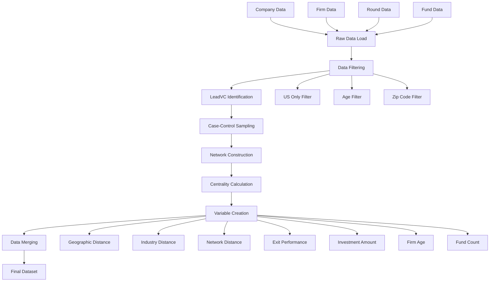
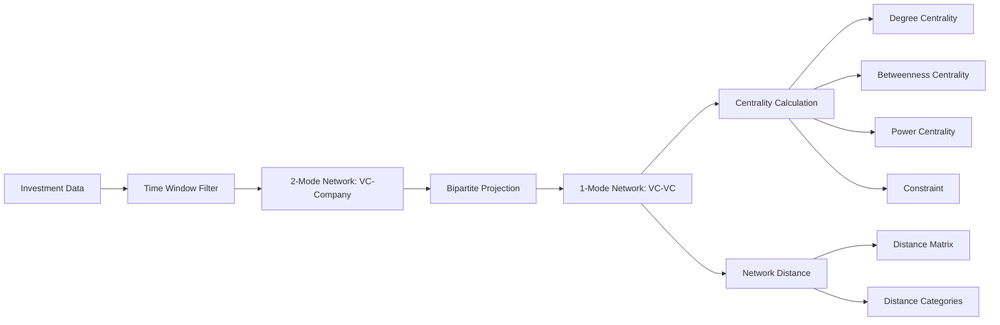
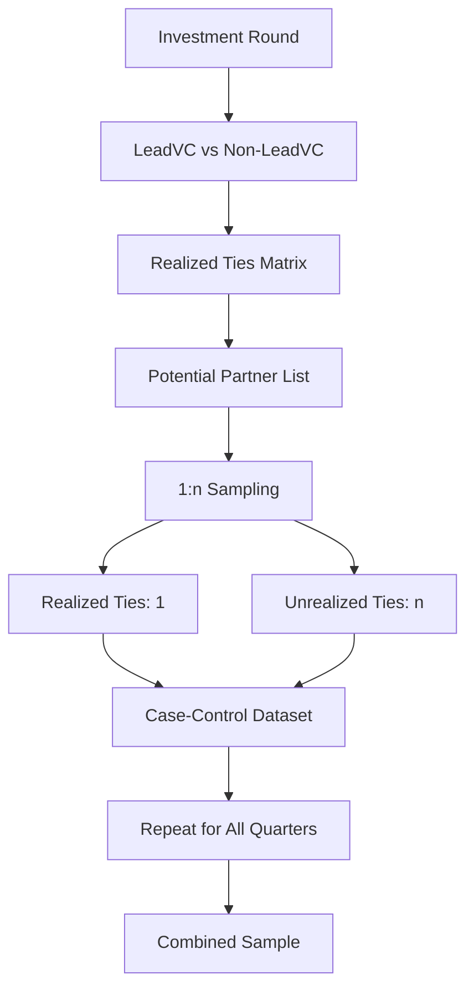
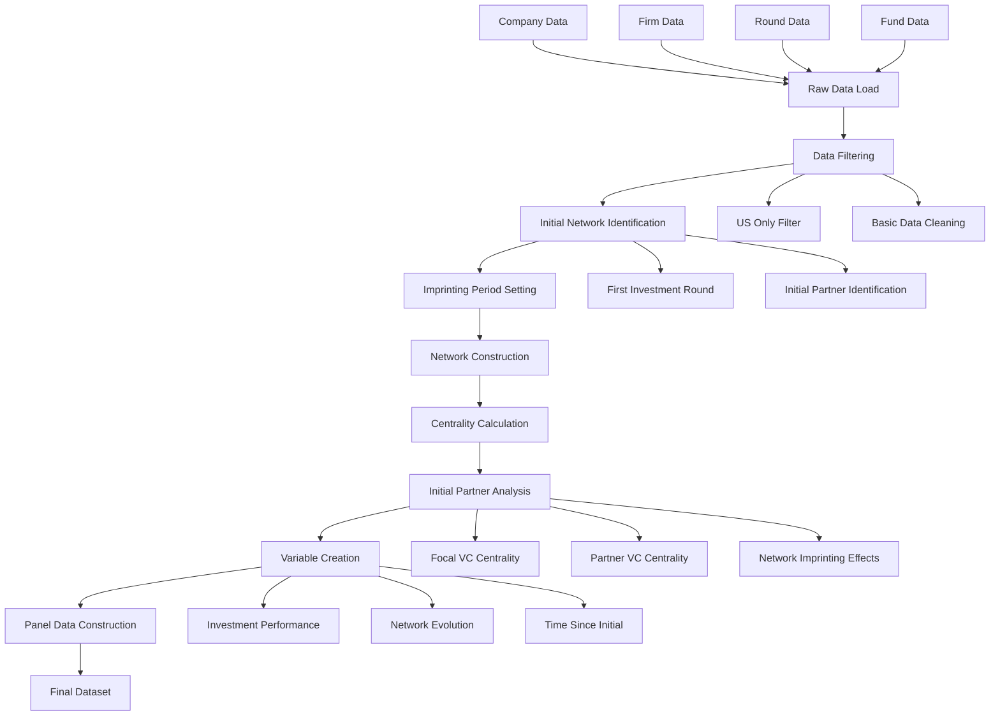
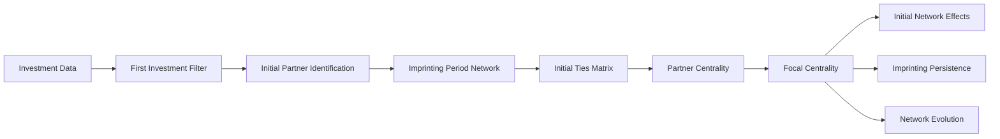
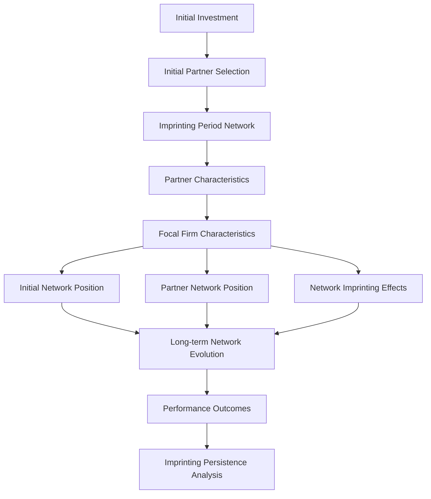

# VC 네트워크 분석 R 코드 비교 문서

## 개요
이 문서는 `CVC_preprcs_v4.R`과 `imprinting_Dec18.R` 파일의 함수들과 데이터 처리 플로우를 비교 분석한 내용입니다. 두 코드 모두 VentureXpert 데이터를 활용하여 벤처캐피탈(VC) 네트워크 분석을 위한 전처리 작업을 수행하지만, 각각 다른 연구 목적을 가지고 있습니다.

## Part 1: 두 R 파일의 공통 함수

### 1.1 네트워크 구성 함수

#### 1.1.1 `VC_matrix()` 함수
**공통 목적**: VC-to-VC 네트워크의 인접행렬(adjacency matrix) 생성

**공통 로직**:
1. **시간 윈도우 설정**: `time_window` 파라미터에 따라 특정 기간의 투자 데이터 선택
2. **2-mode 네트워크 구성**: VC-Company 투자 관계를 기반으로 2-mode 네트워크 생성
3. **1-mode 네트워크 변환**: `bipartite_projection()`을 통해 VC-to-VC 네트워크로 변환

**핵심 처리 과정**:
```r
# 2-mode 네트워크: VC-Company 투자 관계
twomode <- graph_from_edgelist(as.matrix(edgelist), directed = FALSE)
V(twomode)$type <- V(twomode)$name %in% edgelist[,2]

# 1-mode 네트워크: VC-to-VC 공동투자 관계
onemode <- bipartite_projection(twomode)$proj1
```

**차이점**:
- **CVC_preprcs_v4.R**: `proj1` 사용 (VC-VC 관계)
- **imprinting_Dec18.R**: `proj2` 사용 (Event-Event 관계)

#### 1.1.2 `VC_centralities()` 함수
**공통 목적**: 네트워크 중심성 지표들 계산

**공통 계산 지표들**:
- **Degree Centrality**: 직접 연결된 노드 수
- **Betweenness Centrality**: 최단경로 중간자 역할 정도
- **Power Centrality**: 다양한 베타값으로 계산
- **Constraint**: 구조적 구멍(structural hole) 지표

**베타값 계산 로직**:
```r
upsilon <- max(eigen(as_adjacency_matrix(adjmatrix))$values)
pwr_p75 <- power_centrality(adjmatrix, exponent = (1/upsilon)*0.75)
```

**차이점**:
- **CVC_preprcs_v4.R**: 기본 중심성 지표만 계산
- **imprinting_Dec18.R**: 추가로 Ego Network Density 계산 포함

### 1.2 데이터 처리 공통 함수

#### 1.2.1 `blau_index()` 함수
**공통 목적**: VC의 투자 다양성 측정을 위한 Blau 지수 계산

**공통 계산 과정**:
1. **산업별 투자 횟수 집계**: 각 VC의 산업별 투자 횟수 계산
2. **투자 비율 계산**: 전체 투자 대비 산업별 비율
3. **Blau 지수 계산**: 1 - Σ(산업별 비율²)

**핵심 로직**:
```r
blau <- b_df %>%
  rowwise() %>%
  mutate(sum = sum(c_across(3:ncol(b_df)))) %>%
  mutate(across(3:ncol(b_df), ~.x/sum)) %>%
  mutate(across(3:ncol(b_df), ~.x^2)) %>%
  select(-sum) %>%
  mutate(blau = 1 - sum(c_across(3:ncol(b_df))))
```

## Part 2: 각 R 파일의 고유 함수

### 2.1 CVC_preprcs_v4.R 고유 함수

#### 2.1.1 Sampling 함수들
**`VC_sampling_opt1()` 함수**
- **목적**: Case-control sampling 방식으로 1:n 비율의 샘플링 수행
- **특징**: LeadVC-PartnerVC 관계의 실현/미실현을 구분하여 샘플링

**`VC_sampling_opt1_output()` 함수**
- **목적**: 전체 기간에 대한 샘플링 결과를 통합 관리
- **특징**: 분기별 반복 샘플링 및 진행률 모니터링

#### 2.1.2 LeadVC 식별 함수
**`leadVC_identifier()` 함수**
- **목적**: 각 투자 라운드에서 LeadVC를 식별
- **판단 기준**: 첫 라운드 투자자, 투자 비율, 총 투자 금액

#### 2.1.3 거리 계산 함수들
**`netDist_count()` 함수**
- **목적**: VC 간 네트워크 거리 계산
- **특징**: 최단경로 기반 거리 분류 (1, 2, 3+ 단계)

**`zip_distance()` 관련 함수들**
- **목적**: 우편번호 기반 지리적 거리 계산
- **특징**: VC 간, VC-회사 간 거리 계산

#### 2.1.4 Exit 성과 함수들
**`VC_exit_num()`, `VC_IPO_num()`, `VC_MnA_num()` 함수들**
- **목적**: VC의 Exit, IPO, M&A 회수 계산
- **특징**: 5년간 투자 이력에서 성과 집계

### 2.2 imprinting_Dec18.R 고유 함수

#### 2.2.1 Initial Network 함수들
**`VC_initial_ties()` 함수**
- **목적**: VC의 초기 네트워크 관계 식별
- **특징**: 첫 번째 투자 라운드에서 형성된 파트너십 관계 추출

**`VC_initial_period()` 함수**
- **목적**: 초기 네트워크 기간 설정
- **특징**: Imprinting 기간 내의 네트워크 관계만 필터링

#### 2.2.2 Initial Partner 분석 함수들
**`VC_initial_focal_centrality()` 함수**
- **목적**: 초기 파트너와의 관계에서 Focal VC의 중심성 계산
- **특징**: 초기 파트너들의 평균 중심성 지표 계산

**`VC_initial_partner_centrality()` 함수**
- **목적**: 초기 파트너들의 중심성 지표 계산
- **특징**: Degree는 합계, 나머지는 평균으로 집계

#### 2.2.3 데이터 식별 함수들
**`date_unique_identifier()` 함수**
- **목적**: 데이터에서 고유한 날짜/기간 식별자 추출
- **특징**: 오름차순 정렬된 벡터 반환

## Part 3: 데이터 처리 플로우

### 3.1 CVC_preprcs_v4.R 데이터 플로우

#### 3.1.1 전체 데이터 처리 과정



#### 3.1.2 네트워크 구성 플로우



#### 3.1.3 Sampling 플로우



### 3.2 imprinting_Dec18.R 데이터 플로우

#### 3.2.1 전체 데이터 처리 과정



#### 3.2.2 Initial Network 구성 플로우



#### 3.2.3 Imprinting 분석 플로우



### 3.3 주요 데이터 처리 단계 비교

#### 3.3.1 CVC_preprcs_v4.R 처리 단계
1. **데이터 필터링**: 미국 VC, Angel 제외, 연령/위치 필터
2. **LeadVC 식별**: 3가지 기준으로 LeadVC 결정
3. **샘플링 전략**: 1:10 비율의 Case-Control 샘플링
4. **네트워크 변수**: 중심성, 거리, 구조적 구멍
5. **지리적/산업적 변수**: 우편번호 거리, 산업 거리, Blau 지수
6. **성과 변수**: Exit, 투자 규모, 펀드 수

#### 3.3.2 imprinting_Dec18.R 처리 단계
1. **데이터 필터링**: 기본적인 데이터 정제
2. **초기 네트워크 식별**: 첫 투자 라운드에서의 파트너십
3. **Imprinting 기간 설정**: 초기 네트워크 영향 기간 정의
4. **초기 파트너 분석**: 초기 파트너들의 네트워크 특성
5. **Focal VC 분석**: 초기 네트워크에서의 Focal VC 위치
6. **Panel 데이터 구성**: 시간에 따른 네트워크 진화 분석

### 3.4 최종 출력 데이터 비교

#### 3.4.1 CVC_preprcs_v4.R 출력
- **관찰 단위**: LeadVC-PartnerVC-Company 조합
- **시간 단위**: 분기별 데이터
- **샘플 크기**: 1:10 비율의 Case-Control 샘플
- **주요 변수**: 네트워크, 지리적, 산업적, 성과 변수

#### 3.4.2 imprinting_Dec18.R 출력
- **관찰 단위**: Firm-Year 레벨
- **시간 단위**: 연도별 데이터
- **샘플 크기**: 전체 VC 샘플
- **주요 변수**: 초기 네트워크 특성, Imprinting 효과, 네트워크 진화

### 3.5 연구 목적 차이

#### 3.5.1 CVC_preprcs_v4.R
- **연구 목적**: LeadVC의 파트너 선택 결정요인 분석
- **분석 방법**: Case-Control 샘플링을 통한 로지스틱 회귀
- **핵심 변수**: 네트워크 거리, 지리적 거리, 산업적 유사성

#### 3.5.2 imprinting_Dec18.R
- **연구 목적**: 초기 네트워크의 장기적 영향(Imprinting) 분석
- **분석 방법**: Panel 데이터를 통한 시계열 분석
- **핵심 변수**: 초기 파트너 특성, 네트워크 진화, Imprinting 지속성

이 비교 분석 문서는 두 VC 네트워크 연구 코드의 공통점과 차이점을 명확히 보여주며, 각각의 연구 목적에 따른 데이터 처리 방식의 차이를 이해하는 데 도움이 됩니다. 